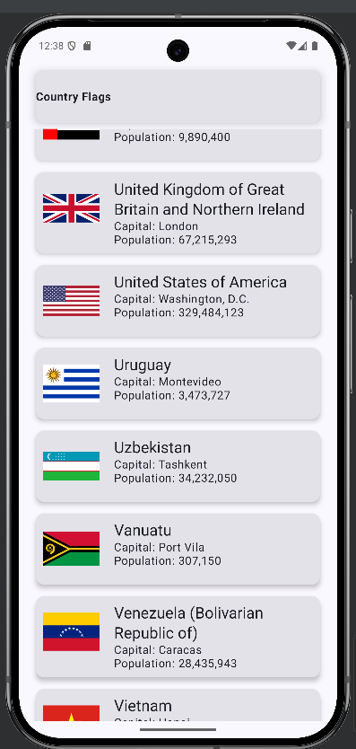
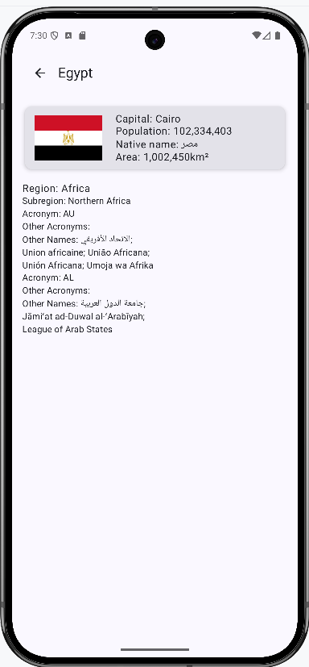

# Country Flags Android App

## Table of Contents
1. [Overview](#overview)
2. [Features](#features)
3. [Screenshots](#screenshots) 
4. [Tech Stack & Libraries](#tech-stack--libraries)
5. [Setup & Installation](#setup--installation)
6. [API](#api)
7. [Project Structure](#project-structure) (Brief)
8. [Error Handling](#error-handling)
9. [Future Enhancements](#future-enhancements) (Optional)
10. [Contributing](#contributing) (Optional)
11. [License](#license)

## Overview
The Country Flags app is an Android application built using modern Android development practices. It displays a list of countries along with their flags, capitals, and populations. Users can view details for each country. The app demonstrates the use of Jetpack Compose for the UI, Koin for dependency injection, Ktor for networking, and Room for local data persistence.
* 

## Features
* Displays a list of countries with their flags.
* Shows details for each country:
    * Name
    * Capital
    * Population (formatted)
    * Flag image
* Fetches country data from a remote API.
* Caches data locally using Room database for offline access and faster loading.
* Utilizes a responsive UI built with Jetpack Compose.
* Handles network errors gracefully.
* *(Add any other specific features your app has, e.g., search functionality, sorting, dark mode, etc.)*

## Screenshots
*

| Main List Screen | Detail Screen (if any)                       |
|---|----------------------------------------------|
|  |  |

## Tech Stack & Libraries
* **UI:**
    * [Jetpack Compose](https://developer.android.com/jetpack/compose): Modern toolkit for building native Android UI.
    * [Material 3](https://m3.material.io/): Design system.
    * [Coil](https://coil-kt.github.io/coil/): Image loading library for Compose.
* **Architecture:**
    * MVVM (Model-View-ViewModel): Separation of concerns.
* **Dependency Injection:**
    * [Koin](https://insert-koin.io/): Pragmatic lightweight dependency injection framework.
* **Networking:**
    * [Ktor Client](https://ktor.io/docs/client-feature-overview.html): Asynchronous HTTP client.
    * [Kotlinx Serialization](https://github.com/Kotlin/kotlinx.serialization): For JSON parsing.
* **Data Persistence:**
    * [Room Persistence Library](https://developer.android.com/training/data-storage/room): Local database for caching.
* **Asynchronous Programming:**
    * [Kotlin Coroutines](https://kotlinlang.org/docs/coroutines-overview.html): For managing background threads and asynchronous operations.
* **Build Tool:**
    * Gradle
* **Language:**
    * Kotlin

## Setup & Installation
1. **Clone the repository:**
2. **Open in Android Studio:**
    * Open Android Studio.
    * Click on "Open an Existing Project".
    * Navigate to the cloned repository folder and select it.
3. **Build the project:**
    * Android Studio should automatically sync and build the project. If not, click on `Build > Make Project`.
4. **Run the app:**
    * Select an emulator or connect a physical Android device.
    * Click the "Run" button (green play icon) in Android Studio.

**Prerequisites:**
* Android Studio (latest stable version recommended - e.g., Iguana | 2023.2.1 or newer)
* Android SDK
* *(Specify if a particular API level is required for building or running, e.g., Min SDK 24)*

## API
This project fetches country data from the following API:
* **API Name:** ApiCountries - The Free RESTful Countries Data API
* **Base URL:** `https://www.apicountries.com/` (or the specific base URL Ktor is configured with)
* **Endpoint Used:** `/countries`
* **Authentication:** n/a

## Project Structure

## Error Handling
* Network request errors (e.g., timeouts, HTTP errors) are caught in the repository layer.
* The UI is updated to reflect loading states or error messages.
* *(Mention specific strategies, e.g., "Uses a NetworkResult sealed class to propagate success/error states to the ViewModel.")*

## Future Enhancements
* Search functionality for countries.
* Sorting countries by name, population, etc.
* Offline mode improvements (e.g., more robust conflict resolution).
* Dark mode theme.
* Unit and UI tests.
* Detailed country screen.

## Contributing
Contributions are welcome! If you'd like to contribute, please follow these steps:
1. Fork the repository.
2. Create a new branch (`git checkout -b feature/your-feature-name`).
3. Make your changes.
4. Commit your changes (`git commit -m 'Add some feature'`).
5. Push to the branch (`git push origin feature/your-feature-name`).
6. Open a Pull Request.

Please make sure to update tests as appropriate.

## License
This project is licensed under the MIT License - see the [LICENSE](LICENSE) file for details.

## Contact
Donald McCaskey - [forteanjo@sky.com](mailto:forteanjo@sky.com)
